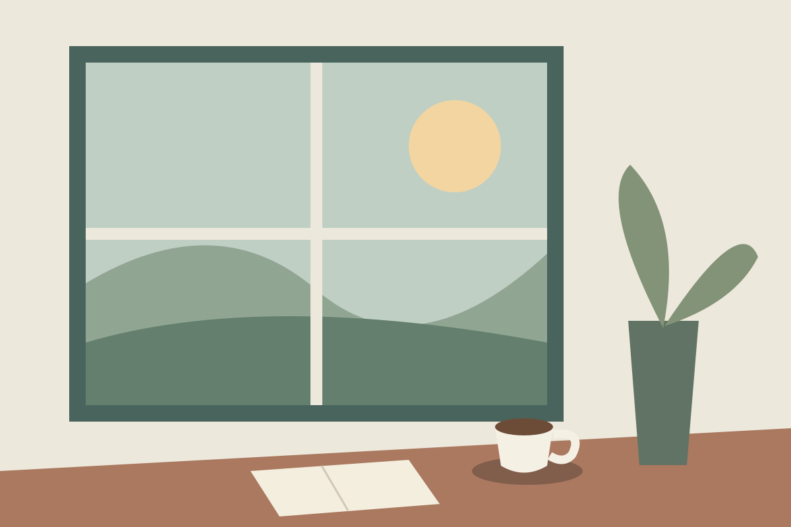

这周末不准备安排太多事情。

洗完衣服，把桌面清出一小块空地，然后挑一本不是为了学习而读的书。读不完也没关系。门外有人经过，楼下传来自行车的铃声，窗里的光一点点向旁边挪。

## 不需要把一天填满

有时候，休息也会被排成另一张清单：几点出门、去哪家店、拍什么照片，再在晚上检查有没有完成。

这次试着反过来。先留出空白，看看想做什么自己浮上来。

> 一天并不需要被完整记录。留下一个片段，也足够。

上面这张插图使用最普通的 Markdown 写法，无需导入组件。需要与图片绑定的小字说明时，可以改用另外两篇示例里的 Figure。

## 晚上再写三句话

今天看见了什么？什么让我停了一下？有什么想留到下周再做？

不必每天都有答案。日常博客的好处，大概就是可以从这样很小的一段文字开始。
